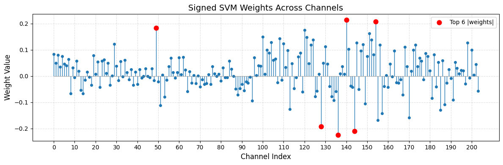
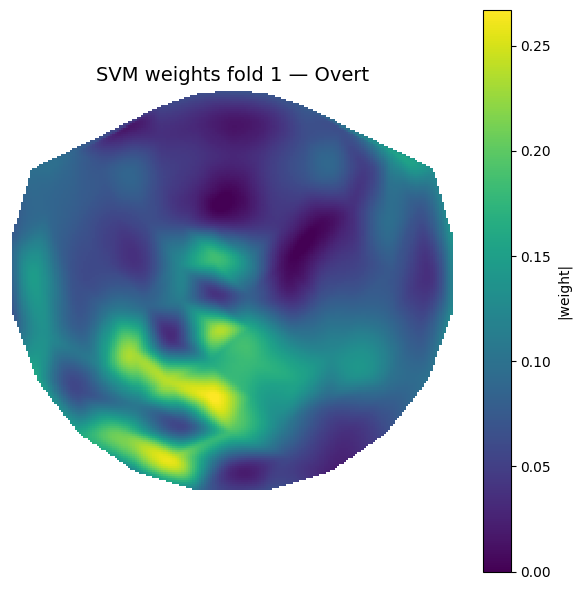
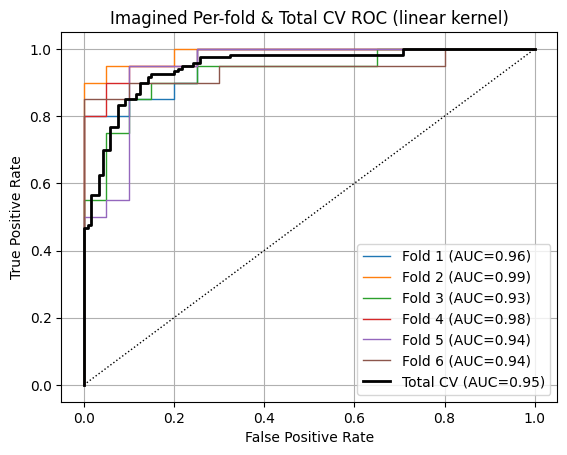

# BCI Movement Decoding

> A lot of words about what the project does and how it works!

# Introduction

Every year approximately 15.4 million people live paralyzed [^1]. Many of these people will never be able to move their extremities for the rest of their lives. Despite having neurological activity, they simply do not have motor function, significantly impeding their quality of life​. BCIs are a new promising technological solution for these patients. In the situation of a compromised nervous system, brain signals that intend for certain movements do not get received. The goal of the BCI is to act as a secondary nervous system, receiving signals from the brain and using them to control external devices. These external devices can include prosthetic limbs, powered wheelchairs, and computer interfaces [^2]. BCIs allow patients to exercise control and interact with their environment in a way not previously possible. [Figure 1](#fig-bci) demonstrates how the BCI goes from reading in signals from the brain through various mechanisms before applying a decoding algorithm to understand the patient's intended input.

<figure id="fig-bci" style="display: block; margin: 0 auto; text-align: center;">
  
  <figcaption><strong>Figure 1.</strong> An overview of how a BCI works to decode brain signals.</figcaption>
</figure>

<p style="text-align:center;">Figure from <a href="#/?id=fnref-2">[2]</a></p>

## Project Goals/Motivation

This project seeks to implement the underlying logic behind a BCI: **given a patient's neurological signals (EEG), how can we accurately decode the patient's movement?** We seek to build a Support Vector Machine (SVM) decoder that can distinguish whether the patient is trying to move their left or right hand based on EEG signals. The potential implications of this work include:

- If we can accurately decode intent—even when no actual movement occurs—we open the door to restoring communication or control for individuals with paralysis.
- Visualizations may allow us to better understand the human brain: how certain regions of neurologic activity correspond to motor functionality​.
  ​

## Data Sources in this Project

For this project, we utilize electroencephalogram (EEG) to represent a patient's brain activity. An electroencephalogram (EEG) is a non-invasive diagnostic test that detects abnormalities in brain wave patterns by measuring the electrical activity produced by the brain [^2]. All the data for this experiment was collected in two settings.

- **EEG Dataset 1 (Imagined)** - EEGs were recorded while the patients imagined moving either their left or right hands.
- **EEG Dataset 2 (Overt)** - EEGs were recorded while the patients physically moved either their left or right hands.

In each case, the data form a binary classification problem (movement 1 vs. movement 2), but the mapping of left/right to labels is not provided up front. Overt-movement trials give us a clear neurophysiological signature and serve as a benchmark for classifier performance when physical motion is present, while imagined-movement trials represent the real-world goal of a BCI—to decode intention in the absence of actual movement. Decoding on imagined data presents a harder challenge as the brain signals indicating movement are not as strong. Training and testing on both datasets ensures our decoder not only works when movements are overt, but also generalizes to the imagined-movement scenarios that are essential for restoring control in people with paralysis.

We were also provided with another source of data: BCI_sensor(x,y). Unlike the other datasets, this data simply consisted of the coordinates locations of all the electrodes. Later, we demonstrate how we utilize this data to generate effective visualizations and better understand model inference.

## Why SVM was Chosen

The Support Vector Machine (SVM) was originally proposed as by Boser et al [^3]. In the case of a binary classification problem, the main idea behind any SVM classification is finding the greatest margin between the two classes. The SVM works by constructing an optimal hyperplane in the input dimension space that separates the classes. As can be seen in [Figure 2](#fig-svm), the SVM finds the hyperplane separating class 1 and class 2. The points closest to the hyperplane on either side of the boundary are support vectors.

<figure id="fig-svm" style="display: block; margin: 0 auto; text-align: center;">
  
  <figcaption><strong>Figure 2.</strong> An overview of how a SVM finds the decision boundary between two classes.</figcaption>
</figure>

<p style="text-align:center;">Figure from <a href="#/?id=fnref-4">[4]</a></p>

One of the difficulties of working with EEG recordings in a machine learning context is that each recording will often have dozens or hundreds of channels. However, despite the dimensionality being high oftentimes there aren't be a sufficient number of samples since EEGs are not often released into publicly available datasets. This leads to situations where the dimensionality can exceed the number of training samples ("small-n, large-p"). The SVM classifier handles this situation gracefully because the complexity of its decision boundary depends on the margin width and the number of support vectors, not directly on the total feature count. In practice, even when the dimensionality far exceeds the number of training samples, the margin-maximization principle prevents overfitting and yields a classifier that is able to generalize well. This is in contrast to other classifiers which would develop a complicated decision statistic, leading to overfitting.

# Mathematical Formulation

## Support Vector Machines

Now, we will explore how SVMs mathematically determine the decision boundary between two classes. We start out with our dataset which is defined by pairs of N pairs of $ (x_1, y_1), (x_2, y_2) \dots (x_N, y_N) $. For each pair $x_i \in \mathbb{R}^p$ and $y_i \in \{-1,1\} $, $x_i$ denotes the features while $y_i$ provides the class label. Now, we can define the hyperplane separating the two classes:

$$
    f(x) = x^T\omega + b
$$ This is where $\omega$ is a weight vector (for now let's assume it's a unit vector). $f(x)$ can also be used to form the decision boundary where depending on the sign of $f(x_i)$, point $x_i$ will be classified as one class versus the other. Now we can formulate an optimization problem:


$$

    max M : y_i (x_{i}^{T}\omega + b) \geq M, i = 1, 2, \dots N

$$

Dropping the constraint of $\omega$ being a weight vector and assuming that $M = 1 / ||\omega||$ gives the more general support vector machine optimization problem.


$$

    min ||\omega|| : y_i (x_{i}^{T}\omega + b) \geq 1, i = 1, 2, \dots N

$$

Interpreting this optimization problem, we are effectively looking for the smallest $\omega$ such that the hyperplane correctly splits all of the data points perfectly. This is not going to be feasible for many datasets which have overlap between the two classes. We now introduce $\xi = \{\xi_1, \xi_2 \dots \xi_N \}$, slack variables which are allowed to be incorrectly classified. All the slack variables are nonnegative. If $x_i > 1$, then the point $i$ is incorrectly classified. Otherwise for $0 \leq x_i \leq 1$, point $i$ is correctly classified. [Figure 2](#fig-svm) provides a visual illustration of a slack variable, the class 1 data point is incorrectly classified as class 0. Now the previous objective is reframed


$$

    min \frac{1}{2} ||B||^2 + C\sum_{i=1}^{N}\xi_i

$$


$$

    \textbf{s.t.}, \xi_i \geq 0, y_i(x_{i}^T\omega + b) \geq 1 - \xi_i, \forall i

$$

In this objective, $C$ represents a regularization parameter. How highly we want to penalize missclassifications. A large C will prioritize classifying points correctly while a low C will prioritize maximizing the margin. Mathematical derivations taken from [^5].

### Optimization

<span style = "color: red"> TODO: talk about how we optimize svm lol
</span>
### Kernel Trick


So far, only linear kernels have been discussed. These yield SVM classifiers that linearly divide the data. While this can be sufficient for some data, oftentimes the optimal decision boundary will be more complex, requiring nonlinear decision boundaries. The "kernel trick" is a method which allows the SVM to effectively learn nonlinear decision boundaries. This process involves enlarging the feature space and learning a linear boundary in the new feature space. In the original space, these boundaries are often nonlinear and can better separate the data.

<span style = "color: red">TODO: provide maths for kernels and provide some common kernels </span>


# Methodology

## Visualizing the Electrode Placement

The first step of the project was to visualize the placement of all the electrodes in the brain. This was accomplished by plotting the locations of the electrodes provided in the BCIsensor_xy dataset. First, all the data (102 rows of x,y coordinates) was read into a Pandas [^6] dataframe before using Matplotlib [^7] to plot all the locations.

```python
import matplotlib.tri as mtri

df_BCI = pd.read_csv("BCIsensor_xy.csv", names = ["x", "y"]) #read in as pandas dataframe

def plot_electrode_layout(df, annotate_indices=None, point_size=30):
    xs = df['x'].values
    ys = df['y'].values

    # Build a triangulation to connect nearest neighbors
    triang = mtri.Triangulation(xs, ys)

    # Plot
    fig, ax = plt.subplots(figsize=(6,6))
    ax.triplot(triang, color='lightblue', linewidth=1)
    ax.scatter(xs, ys, color='blue', s=point_size, zorder=2)

    # Annotate specific channels, if given
    if annotate_indices:
        for idx in annotate_indices:
            ax.text(xs[idx], ys[idx], str(idx+1),
                    fontsize=9, color='black',
                    verticalalignment='bottom',
                    horizontalalignment='right')

    ax.set_aspect('equal', 'box')
    ax.axis('off')
    ax.set_title("Electrode Placements")
    plt.show()

plot_electrode_layout(df_BCI, annotate_indices=range(102))
```

[Figure 3](#fig-electrodes) demonstrates the location of all the electrodes relative to the brain surface. Later, this will provide the necessary context to understand the model outputs.


<figure id="fig-electrodes" style="display: block; margin: 0 auto; text-align: center;">
  
  <figcaption><strong>Figure 3.</strong> A visualization of the electrode placements.</figcaption>
</figure>

## Data Loading

We were given the overt and imagined datasets across four CSV files. The data was split based on overt or imagined and also 1 vs 2 (corresponding to left/right hand movement). The first step was to load all the data into four Pandas dataframes.

```python
df_over_1 = pd.read_csv("feaSubEOvert_1.csv", names = range(120))
df_over_2 = pd.read_csv("feaSubEOvert_2.csv", names = range(120))

df_img_1 = pd.read_csv("feaSubEImg_1.csv", names = range(120))
df_img_2 = pd.read_csv("feaSubEImg_2.csv", names = range(120))
```

After the data was read into four dataframes, we created a method that would convert them to the standard $X$ feature matrix and $y$ label vector. In the end, there were 240 trials and 204 features meaning $X \in \mathbb{R}^{240*204}, y \in \mathbb{R}^{240}$.

```python
def convertToXY(df_class_1, df_class_2, trials = 120):
    X = []
    y = []
    for i in range(trials):
        X.append(np.array(df_class_1[i]))
        y.append(0) #note that while mathematically SVM expects y to be -1, 1 this is handled by sklearn internally


        X.append(np.array(df_class_2[i]))
        y.append(1)

    X = np.array(X)
    y = np.array(y)

    return X, y

X_img, y_img = convertToXY(df_img_1, df_img_2)
X_over, y_over = convertToXY(df_over_1, df_over_2)
```
## Training Scenarios

Throughout this project, there are a total of four training scenarios presented:

- **Same-Train: Overt Movement**: We trained SVM on the overt movement before also evaluating on the overt movement dataset
- **Same-Train: Imagined Movement**: We trained SVM on the imagined movement before also evaluating on the imagined movement dataset.
- **Cross-Train: Overt->Imagined** We trained SVM on the overt movement before evaluating on the imagined dataset.
- **Cross-Train: Imagined->Overt** We trained SVM on the imagined movement before evaluating on the overt dataset.


Generally speaking, classification on the imagined dataset had lower performance than classification on the overt dataset. EEGs from the imagined dataset had weaker signals when compared to their overt counterparts. Thus, it was easier for an SVM to recognize some of the movement signals in the overt data and achieve higher accuracy and area under the ROC curve.

When training and testing on the same type of data, we got a baseline for how accurately the SVM picked up the neural signatures when there’s no domain shift. On the cross-train scenarios, we tested generalization. The Overt->Imagined trials demonstrated how learning on overt-movement was still very applicable to imagined movement with weaker signals. Conversely, when we tested Imagined->Overt, we observed how the lack of stronger signals in training affected the model's performance. For the same-train scenarios, we employed two-level cross validation. On the cross train scenarios, we performed cross-validation to first select the regularization parameter, before training on the entire train dataset and testing on the entire test dataset.

## Two-Level Cross Validation

<figure id="fig-cv" style="display: block; margin: 0 auto; text-align: center;">
  
  <figcaption><strong>Figure 4.</strong> An overview of two-level cross validation.</figcaption>
</figure>

[Figure 4](#fig-cv) demonstrates a high-level overview of our two-level cross validation approach. The first step is dividing the data into 6 stratified folds (class proportions are preserved in each fold). Each fold has a set of 200 trials for training and 40 trials withheld for testing. The 200 training trials are then used to perform a second-level cross validation procedure. In the second level, we tested 0.01, 1, 100, and 10000 as regularization parameter (denoted now as $\alpha$, previously referred to as C) values. The $\alpha$ value with the highest second-level cross-validated accuracy was then selected. Finally, we trained an SVM with the optimal $\alpha$ which yielded our per-fold results in the form of accuracy metrics and an ROC curve. After performing the procedure on all folds, we aggregated per-fold results to obtain the model's overall performance.

In our cross‐validation experiments, we observed that performance varied less across folds when we trained and tested on overt‐movement data than on the imagined‐movement trials. We found that the EEG patterns during actual arm movements were stronger and more consistent, so each fold contained similar examples and yielded a stable decision boundary. In contrast, imagery signals were weaker and more sensitive to factors like attention and fatigue, which meant different folds sampled different mixes of clear versus faint trials. As a result, our ROC and accuracy scores fluctuated more across folds for the imagined‐movement condition ​

Full code with the training, evaluation, and visualization procedures is available in the [Appendix](#appendix).
# Results

## Same-train: Overt

The first scenario: training and testing on overt had by far the best performance out of any scenario. As shown in [Figure 5](#fig-roc1), the model achieved near-perfect AUC across the six folds. The per-fold accuracies were 92.5\%, 100\%, 97.5\%, 97.5\%, 90\%, and 95\%. The model's overall cross-validated accuracy was 95.4\%. In the case of the overt dataset, the per-fold ROC and accuracy closely matched the overall classification performance, meaning fold performance was relatively representive of overall performance. [Figure 5](#fig-roc1) contains the ROC curves for each fold as well as the overall ROC curve.

<figure id="fig-roc1" style="display: block; margin: 0 auto; text-align: center;">
  
  <figcaption><strong>Figure 5.</strong> ROC curve for SVM trained and evaluated on overt data.</figcaption>
</figure>


Next, we visualized the SVM weights. [Figure 6](#fig6) contains a stem plot with the channel index on the x-axis and the signed SVM weight on the y-axis. [Figure 7](#fig7) contains a visualization of the weights across the surface of the brain. To project the weights onto the cortical surface, we collapsed the original 204-element weight vector into a 102-element vector of per-electrode magnitudes by pairing each electrode’s two features (e.g. indices 1 & 2, 3 & 4, 5 & 6, etc.) and computing their Euclidean norm.

<div class="figure-row">

  <div class="figure-item" style="display: flex; flex-direction: column;">

<figure id="fig6">


<figcaption><strong>Figure 6.</strong> Signed SVM weights across channels for 1st fold (highlighted top 6). The table below contains the highest weights by magnitude and their respective channel indices. </figcaption>
</figure>


<table style="
      align-self: center;
      width: auto;
      border-collapse: collapse;
      ">
    <thead>
    <tr>
        <th style="border-bottom:1px solid #ccc; padding: 0.4em;">Channel index</th>
        <th style="border-bottom:1px solid #ccc; padding: 0.4em;">Weight</th>
    </tr>
    </thead>
    <tbody>
    <tr><td style="padding: 0.4em;">154</td><td style="padding: 0.4em;">0.0014</td></tr>
    <tr><td style="padding: 0.4em;">140</td><td style="padding: 0.4em;">0.0013</td></tr>
    <tr><td style="padding: 0.4em;">136</td><td style="padding: 0.4em;">-0.0011</td></tr>
    <tr><td style="padding: 0.4em;">100</td><td style="padding: 0.4em;">0.0010</td></tr>
    <tr><td style="padding: 0.4em;">151</td><td style="padding: 0.4em;">0.0009</td></tr>
    <tr><td style="padding: 0.4em;">155</td><td style="padding: 0.4em;">-0.0008</td></tr>
    </tbody>
</table>


  </div>

  <!-- Right column: heatmap figure unchanged -->
  <figure class="figure-item" id="fig7">
    
    <figcaption><strong>Figure 7.</strong> Topographic heatmap of SVM weights (fold 1, overt).</figcaption>
  </figure>

</div>

From these two figures, we show that the highest magnitude weight channel indices are all within the 100 to 160 range. These correspond to electrodes 50 to 80. When referencing [Figure 3](#fig-electrodes), we see these electrodes are located in the bottom left quadrant of the brain, the same region heavily highlighted in [Figure 7](#fig-7).

## Same-train: Imagined

Next, we performed training and evaluation on the imagined dataset. This dataset proved to be more challenging with the overall cross-validated accuracy dropping to 87.9\%. The accuracy across folds varied significantly more: 85\%, 80\%, 82.5\%, 97.5\%, 90.0\%, 92.5\%. [Figure 8](#fig-roc1) contains the per-fold and overall cross-validated ROC curves.
<span style = "color: red"> TODO: talk about lack of consistency
</span>

<figure id="fig-roc1" style="display: block; margin: 0 auto; text-align: center;">
  
  <figcaption><strong>Figure 8.</strong> ROC curve for SVM trained and evaluated on imagined data.</figcaption>
</figure>

Next, we performed the same weight visualization analysis by plotting the weight stem plot and the heatmap across the brain surface.


<div class="figure-row">

  <div class="figure-item" style="display: flex; flex-direction: column;">

<figure id="fig9">


<figcaption><strong>Figure 9.</strong> Signed SVM weights across channels for 1st fold (highlighted top 6). The table below contains the highest weights by magnitude and their respective channel indices. </figcaption>
</figure>

<table style="
      align-self: center;
      width: auto;
      border-collapse: collapse;
      ">
    <thead>
    <tr>
        <th style="border-bottom:1px solid #ccc; padding: 0.4em;">Channel index</th>
        <th style="border-bottom:1px solid #ccc; padding: 0.4em;">Weight</th>
    </tr>
    </thead>
    <tbody>
    <tr><td style="padding: 0.4em;">151</td><td style="padding: 0.4em;">0.0027</td></tr>
    <tr><td style="padding: 0.4em;">155</td><td style="padding: 0.4em;">-0.0026</td></tr>
    <tr><td style="padding: 0.4em;">154</td><td style="padding: 0.4em;">0.0024</td></tr>
    <tr><td style="padding: 0.4em;">140</td><td style="padding: 0.4em;">0.0024</td></tr>
    <tr><td style="padding: 0.4em;">128</td><td style="padding: 0.4em;">-0.0023</td></tr>
    <tr><td style="padding: 0.4em;">153</td><td style="padding: 0.4em;">-0.0022</td></tr>
    </tbody>
</table>
  </div>

  <!-- Right column: heatmap figure unchanged -->
  <figure class="figure-item" id="fig10">
    
    <figcaption><strong>Figure 10.</strong> Topographic heatmap of SVM weights (fold 1, imagined).</figcaption>
  </figure>

</div>

Interestingly, the SVM when trained on imagined data obtains much greater max weights than the SVM trained on overt data. [Figure 9](#fig-9) also shows the greatest magnitude weights tend to occur in similar locations. Channels 140, 151, 154, and 155 are in the top-6 for both the imagined and overt datasets. This implies that the two datasets likely have similar signals that just happen to vary in strength. [Figure 10](#fig-10) demonstrates that the SVM also heavily focuses on the bottom left quadrant of the brain; however, there are also regions of high weight scattered through the rest of the brain unlike the SVM trained on overt data.

# Appendix


# Works Cited

[^1] World Health Organization. (2024, April 16). Spinal cord injury. https://www.who.int/news-room/fact-sheets/detail/spinal-cord-injury ​\
[^2] Shih, J. J., Krusienski, D. J., & Wolpaw, J. R. (2012). Brain-computer interfaces in medicine. Mayo Clinic proceedings, 87(3), 268–279. https://doi.org/10.1016/j.mayocp.2011.12.008. \
[^3] Boser, B. E., Guyon, I. M., & Vapnik, V. N. (1992, July). A training algorithm for optimal margin classifiers. In Proceedings of the fifth annual workshop on Computational learning theory (pp. 144-152).\
[^4] IBM. (2023, December 27). What are support vector machines (SVMs)? IBM. https://www.ibm.com/think/topics/support-vector-machine. \
[^5] Hastie, T., Tibshirani, R., & Friedman, J. (2009). The elements of statistical learning: Data mining, inference, and prediction (2nd ed.). Springer. https://doi.org/10.1007/978-0-387-84858-7 \
[^6] McKinney, W., & others. (2010). Data structures for statistical computing in python. In Proceedings of the 9th Python in Science Conference (Vol. 445, pp. 51–56). \
[^7] Hunter, J. D. (2007). Matplotlib: A 2D graphics environment. Computing in Science & Engineering, 9(3), 90-95. https://doi.org/10.1109/MCSE.2007.55​
$$
