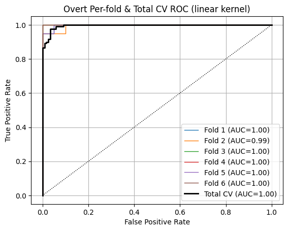

# BCI Movement Decoding

> We present a systematic evaluation of support‐vector‐machine (SVM)–based decoders for distinguishing left- versus right-hand movement from electroencephalogram (EEG) signals under both overt and imagined conditions. Using two-level nested cross-validation, we compare linear, polynomial, and radial-basis‐function (RBF) kernels across four training scenarios—same‐train/overt, same‐train/imagined, cross-train overt→imagined, and cross-train imagined→overt—on a 240-trial dataset with 204 features. Our results show that training and testing on overt data yields the highest accuracy and AUC (≈96 %, AUC ≈ 1.0), while imagined trials are more challenging (≈88 %, AUC ≈ 0.96). RBF kernels outperform linear ones on imagined data, whereas linear kernels suffice for overt data. Cross-training reveals strong generalization from imagined→overt (≈94 %) but weaker transfer from overt→imagined (≈89 %), highlighting a domain-shift effect. These findings underscore the need for neuroscience-informed feature selection and advanced transfer-learning techniques to bridge the gap between imagined and overt EEG decoding.

# Introduction

Every year approximately 15.4 million people live paralyzed [^1]. Many of these people will never be able to move their extremities for the rest of their lives. Despite having neurological activity, they simply do not have motor function, significantly impeding their quality of life​. BCIs are a new promising technological solution for these patients. In the situation of a compromised nervous system, brain signals that intend for certain movements do not get received. The goal of the BCI is to act as a secondary nervous system, receiving signals from the brain and using them to control external devices. These external devices can include prosthetic limbs, powered wheelchairs, and computer interfaces [^2]. BCIs allow patients to exercise control and interact with their environment in a way not previously possible. [Figure 1](#fig-bci) demonstrates how the BCI goes from reading in signals from the brain through various mechanisms before applying a decoding algorithm to understand the patient's intended input.

<figure id="fig-bci" style="display: block; margin: 0 auto; text-align: center;">
  
  <figcaption><strong>Figure 1.</strong> An overview of how a BCI works to decode brain signals.</figcaption>
</figure>

<p style="text-align:center;">Figure from <a href="#/?id=fnref-2">[2]</a></p>

## Project Goals/Motivation

This project seeks to implement the underlying logic behind a BCI: **given a patient's neurological signals (EEG), how can we accurately decode the patient's movement?** We seek to build a Support Vector Machine (SVM) decoder that can distinguish whether the patient is trying to move their left or right hand based on EEG signals. The potential implications of this work include:

- If we can accurately decode intent—even when no actual movement occurs—we open the door to restoring communication or control for individuals with paralysis.
- Visualizations may allow us to better understand the human brain: how certain regions of neurologic activity correspond to motor functionality​.
  ​

## Data Sources in this Project

For this project, we utilize electroencephalogram (EEG) to represent a patient's brain activity. An electroencephalogram (EEG) is a non-invasive diagnostic test that detects abnormalities in brain wave patterns by measuring the electrical activity produced by the brain [^2]. All the data for this experiment was collected in two settings.

- **EEG Dataset 1 (Imagined)** - EEGs were recorded while the patients imagined moving either their left or right hands.
- **EEG Dataset 2 (Overt)** - EEGs were recorded while the patients physically moved either their left or right hands.

In each case, the data form a binary classification problem (movement 1 vs. movement 2), but the mapping of left/right to labels is not provided up front. Overt-movement trials give us a clear neurophysiological signature and serve as a benchmark for classifier performance when physical motion is present, while imagined-movement trials represent the real-world goal of a BCI—to decode intention in the absence of actual movement. Decoding on imagined data presents a harder challenge as the brain signals indicating movement are not as strong. Training and testing on both datasets ensures our decoder not only works when movements are overt, but also generalizes to the imagined-movement scenarios that are essential for restoring control in people with paralysis.

We were also provided with another source of data: BCI_sensor(x,y). Unlike the other datasets, this data simply consisted of the coordinates locations of all the electrodes. Later, we demonstrate how we utilize this data to generate effective visualizations and better understand model inference.

## Why SVM was Chosen

The Support Vector Machine (SVM) was originally proposed as by Boser et al [^3]. In the case of a binary classification problem, the main idea behind any SVM classification is finding the greatest margin between the two classes. The SVM works by constructing an optimal hyperplane in the input dimension space that separates the classes. As can be seen in [Figure 2](#fig-svm), the SVM finds the hyperplane separating class 1 and class 2. The points closest to the hyperplane on either side of the boundary are support vectors.

<figure id="fig-svm" style="display: block; margin: 0 auto; text-align: center;">
  
  <figcaption><strong>Figure 2.</strong> An overview of how a SVM finds the decision boundary between two classes.</figcaption>
</figure>

<p style="text-align:center;">Figure from <a href="#/?id=fnref-4">[4]</a></p>

One of the difficulties of working with EEG recordings in a machine learning context is that each recording will often have dozens or hundreds of channels. However, despite the dimensionality being high oftentimes there aren't be a sufficient number of samples since EEGs are not often released into publicly available datasets. This leads to situations where the dimensionality can exceed the number of training samples ("small-n, large-p"). The SVM classifier handles this situation gracefully because the complexity of its decision boundary depends on the margin width and the number of support vectors, not directly on the total feature count. In practice, even when the dimensionality far exceeds the number of training samples, the margin-maximization principle prevents overfitting and yields a classifier that is able to generalize well. This is in contrast to other classifiers which would develop a complicated decision statistic, leading to overfitting.

## Potential Applications of this Approach

By leveraging advanced pattern‐recognition techniques, machine learning can detect subtle alterations in EEG waveforms that often precede overt clinical symptoms, enabling earlier and more accurate diagnosis of disorders like epilepsy or traumatic brain injury [^15]. Automated, real‐time ML pipelines could continuously monitor patients—alerting clinicians to emergent events, reducing labor‐intensive review of long EEG recordings, and improving patient safety. Furthermore, combining EEG‐based biomarkers with ML‐driven prognostic models would allow truly personalized treatment plans, tailoring medication regimens or neuromodulation protocols to each individual’s unique neural signature. In research settings, perfected ML-EEG analysis would accelerate our understanding of brain network dynamics, opening the door to novel therapeutic targets and biomarkers not only for neurological diseases but also for psychiatric and cognitive disorders.

# Mathematical Formulation

## Support Vector Machines

Now, we will explore how SVMs mathematically determine the decision boundary between two classes. We start out with our dataset which is defined by pairs of N pairs of $ (x_1, y_1), (x_2, y_2) \dots (x_N, y_N) $. For each pair $x_i \in \mathbb{R}^p$ and $y_i \in \{-1,1\} $, $x_i$ denotes the features while $y_i$ provides the class label. Now, we can define the hyperplane separating the two classes:

$$
    f(x) = x^T\omega + b
$$ This is where $\omega$ is a weight vector (for now let's assume it's a unit vector). $f(x)$ can also be used to form the decision boundary where depending on the sign of $f(x_i)$, point $x_i$ will be classified as one class versus the other. We will also have a constant term $b$ which moves the boundary without altering its orientation. Now we can formulate an optimization problem:


$$

    max M : y_i (x_{i}^{T}\omega + b) \geq M, i = 1, 2, \dots N

$$

Dropping the constraint of $\omega$ being a weight vector and assuming that $M = 1 / ||\omega||$ gives the more general support vector machine optimization problem.


$$

    min ||\omega|| : y_i (x_{i}^{T}\omega + b) \geq 1, i = 1, 2, \dots N

$$

Interpreting this optimization problem, we are effectively looking for the smallest $\omega$ such that the hyperplane correctly splits all of the data points perfectly. This is not going to be feasible for many datasets which have overlap between the two classes. We now introduce $\xi = \{\xi_1, \xi_2 \dots \xi_N \}$, slack variables which are allowed to be incorrectly classified. All the slack variables are nonnegative. If $x_i > 1$, then the point $i$ is incorrectly classified. Otherwise for $0 \leq x_i \leq 1$, point $i$ is correctly classified. [Figure 2](#fig-svm) provides a visual illustration of a slack variable, the class 1 data point is incorrectly classified as class 0. Now the previous objective is reframed


$$

    min \frac{1}{2} ||\omega||^2 + C\sum_{i=1}^{N}\xi_i

$$


$$

    \textbf{s.t.}, \xi_i \geq 0, y_i(x_{i}^T\omega + b) \geq 1 - \xi_i, \forall i

$$

In this objective, $C$ represents a regularization parameter. How highly we want to penalize missclassifications. A large C will prioritize classifying points correctly while a low C will prioritize maximizing the margin. Mathematical derivations taken from [^5].

### Optimization

Since there is the $||\omega||^2$ term, this is a quadratic function, optimizing this function is a quadratic programming problem. The surface of this function is a parabolooid, essentially it is a bowl-shaped contour with a single global minimum. The overall global minimum can be found via the Lagrange multipliers method. Since there is guaranteed to be one global minimum, SVMs are considered very reliable for classification problems. There is no risk of finding a local minima but not a global minimum; if a minimum is found it must be the global minimum. The mathematical process for computing the global minimum has been documented in literature [^11] and is implemented in sklearn [^12].

### Kernel Trick


So far, only linear kernels have been discussed. These yield SVM classifiers that linearly divide the data. While this can be sufficient for some data, oftentimes the optimal decision boundary will be more complex, requiring nonlinear decision boundaries. The "kernel trick" is a method which allows the SVM to effectively learn nonlinear decision boundaries. This process involves enlarging the feature space and learning a linear boundary in the new feature space. In the original space, these boundaries are often nonlinear and can better separate the data.

The idea behind the kernel trick is that if we need a dot product between say $<x, x'>$ in a higher dimensional space, we don't need to compute $x$ and $x'$ in that new space. Rather we now have a function $K(x, x') = <x, x'>$, the kernel function [^13]. This function computes the dot product in the higher dimensional space without actually having to recompute the data.

Here are the kernels we tested in this project

**Linear:**


$$

    K(x, x') = x^Tx'

$$

**Polynomial:**


$$

    K(x, x') = (\gamma x^Tx'+r)^d

$$


**Radial Basis Function (RBF):**


$$

    K(x, x') = exp(-\gamma||x-x'||^2)

$$

The linear was our default and baseline kernel. We experimented with all three kernels. In the cases of the polynomial and rbf kernels, we performed a grid search to determine the optimal configuration hyperparameters.
# Methodology

## Visualizing the Electrode Placement

The first step of the project was to visualize the placement of all the electrodes in the brain. This was accomplished by plotting the locations of the electrodes provided in the BCIsensor_xy dataset. First, all the data (102 rows of x,y coordinates) was read into a Pandas [^6] dataframe before using Matplotlib [^7] to plot all the locations.

```python
import matplotlib.tri as mtri

df_BCI = pd.read_csv("BCIsensor_xy.csv", names = ["x", "y"]) #read in as pandas dataframe

def plot_electrode_layout(df, annotate_indices=None, point_size=30):
    xs = df['x'].values
    ys = df['y'].values

    # Build a triangulation to connect nearest neighbors
    triang = mtri.Triangulation(xs, ys)

    # Plot
    fig, ax = plt.subplots(figsize=(6,6))
    ax.triplot(triang, color='lightblue', linewidth=1)
    ax.scatter(xs, ys, color='blue', s=point_size, zorder=2)

    # Annotate specific channels, if given
    if annotate_indices:
        for idx in annotate_indices:
            ax.text(xs[idx], ys[idx], str(idx+1),
                    fontsize=9, color='black',
                    verticalalignment='bottom',
                    horizontalalignment='right')

    ax.set_aspect('equal', 'box')
    ax.axis('off')
    ax.set_title("Electrode Placements")
    plt.show()

plot_electrode_layout(df_BCI, annotate_indices=range(102))
```

[Figure 3](#fig-electrodes) demonstrates the location of all the electrodes relative to the brain surface. Later, this will provide the necessary context to understand the model outputs.


<figure id="fig-electrodes" style="display: block; margin: 0 auto; text-align: center;">
  
  <figcaption><strong>Figure 3.</strong> A visualization of the electrode placements.</figcaption>
</figure>

## Data Loading

We were given the overt and imagined datasets across four CSV files. The data was split based on overt or imagined and also 1 vs 2 (corresponding to left/right hand movement). The first step was to load all the data into four Pandas dataframes.

```python
df_over_1 = pd.read_csv("feaSubEOvert_1.csv", names = range(120))
df_over_2 = pd.read_csv("feaSubEOvert_2.csv", names = range(120))

df_img_1 = pd.read_csv("feaSubEImg_1.csv", names = range(120))
df_img_2 = pd.read_csv("feaSubEImg_2.csv", names = range(120))
```

After the data was read into four dataframes, we created a method that would convert them to the standard $X$ feature matrix and $y$ label vector. In the end, there were 240 trials and 204 features meaning $X \in \mathbb{R}^{240*204}, y \in \mathbb{R}^{240}$.

```python
def convertToXY(df_class_1, df_class_2, trials = 120):
    X = []
    y = []
    for i in range(trials):
        X.append(np.array(df_class_1[i]))
        y.append(0) #note that while mathematically SVM expects y to be -1, 1 this is handled by sklearn internally


        X.append(np.array(df_class_2[i]))
        y.append(1)

    X = np.array(X)
    y = np.array(y)

    return X, y

X_img, y_img = convertToXY(df_img_1, df_img_2)
X_over, y_over = convertToXY(df_over_1, df_over_2)
```

**Our Classification Problem** can be formulated as follows. We are given $X \in \mathbb{R}^{240*204}, y \in \mathbb{R}^{240}$ where $X$ represents the 204 EEG electrical channels and $y$ represents the binary label, denoting left or right movement. We must develop an SVM classifier that finds the optimal $\omega$ and $b$ parameters.

One step we later added to the training pipeline was standardization. Originally, we ignored standardizing the features; however, we found that feature standardization greatly improved performance on nonlinear kernels (for the linear kernel, performance was roughly the same). Thus, we utilized the StandardScaler from sklearn. This essentially performs standardization on each feature independently, computing the mean and scaling all values to unit variance.

```python
pipe = Pipeline([ #training pipeline used
                ('scaler', StandardScaler()),
                ('svc',    SVC(**svc_kwargs)) #kernel, regularization parameter, kernel params, etc...
            ])
```

## Training Scenarios

Throughout this project, there are a total of four training scenarios presented:

- **Same-Train: Overt Movement**: We trained SVM on the overt movement before also evaluating on the overt movement dataset
- **Same-Train: Imagined Movement**: We trained SVM on the imagined movement before also evaluating on the imagined movement dataset.
- **Cross-Train: Overt->Imagined** We trained SVM on the overt movement before evaluating on the imagined dataset.
- **Cross-Train: Imagined->Overt** We trained SVM on the imagined movement before evaluating on the overt dataset.


Generally speaking, classification on the imagined dataset had lower performance than classification on the overt dataset. EEGs from the imagined dataset had weaker signals when compared to their overt counterparts. Thus, it was easier for an SVM to recognize some of the movement signals in the overt data and achieve higher accuracy and area under the ROC curve.

When training and testing on the same type of data, we got a baseline for how accurately the SVM picked up the neural signatures when there’s no domain shift. On the cross-train scenarios, we tested generalization. The Overt->Imagined trials demonstrated how learning on overt-movement was still very applicable to imagined movement with weaker signals. Conversely, when we tested Imagined->Overt, we observed how the lack of stronger signals in training affected the model's performance. For the same-train scenarios, we employed two-level cross validation. On the cross train scenarios, we performed cross-validation to first select the regularization parameter, before training on the entire train dataset and testing on the entire test dataset.

## Two-Level Cross Validation

<figure id="fig-cv" style="display: block; margin: 0 auto; text-align: center;">
  
  <figcaption><strong>Figure 4.</strong> An overview of two-level cross validation.</figcaption>
</figure>

[Figure 4](#fig-cv) demonstrates a high-level overview of our two-level cross validation approach. The first step is dividing the data into 6 stratified folds (class proportions are preserved in each fold). Each fold has a set of 200 trials for training and 40 trials withheld for testing. The 200 training trials are then used to perform a second-level cross validation procedure. In the second level, we tested 0.01, 1, 100, and 10000 as regularization parameter (denoted now as $\alpha$, previously referred to as C) values. The $\alpha$ value with the highest second-level cross-validated accuracy was then selected. Finally, we trained an SVM with the optimal $\alpha$ which yielded our per-fold results in the form of accuracy metrics and an ROC curve. After performing the procedure on all folds, we aggregated per-fold results to obtain the model's overall performance.

Two-level (nested) cross-validation is valuable because it cleanly separates hyperparameter tuning from performance evaluation, preventing the “peeking” that can make results look unrealistically good. In the inner loop, we search over hyperparameters, using only the training portion of each outer fold—so no information about the withheld data ever influences the model configuration. Then the outer loop measures the tuned model’s accuracy and AUC on completely unseen data, providing an unbiased estimate of its performance in practice. This approach not only guards against overfitting hyperparameters, but also quantifies the variability of performance estimates across different splits, giving insight into how stable the model really is.

In our cross‐validation experiments, we observed that performance varied less across folds when we trained and tested on overt‐movement data than on the imagined‐movement trials. We found that the EEG patterns during actual arm movements were stronger and more consistent, so each fold contained similar examples and yielded a stable decision boundary. In contrast, imagery signals were weaker and more sensitive to factors like attention and fatigue, which meant different folds sampled different mixes of clear versus faint trials. As a result, our ROC and accuracy scores fluctuated more across folds for the imagined‐movement condition ​

# Results

## Linear Kernel

### Same-train: Overt

The first scenario: training and testing on overt had by far the best performance out of any scenario. As shown in [Figure 5](#fig-roc1), the model achieved near-perfect AUC across the six folds. The per-fold accuracies were 97.5\%, 95.0\%, 97.5\%, 97.5\%, 95.0\%, and 95.0\%. The model's overall cross-validated accuracy was 96.3\% (std. 1.25). In the case of the overt dataset, the per-fold ROC and accuracy closely matched the overall classification performance, meaning fold performance was relatively representive of overall performance for both accuracy and ROC. [Figure 5](#fig-roc1) contains the ROC curves for each fold as well as the overall ROC curve.

<figure id="fig-roc1" style="display: block; margin: 0 auto; text-align: center;">
  
  <figcaption><strong>Figure 5.</strong> ROC curve for SVM trained and evaluated on overt data.</figcaption>
</figure>


Next, we visualized the SVM weights. [Figure 6](#fig6) contains a stem plot with the channel index on the x-axis and the signed SVM weight on the y-axis. [Figure 7](#fig7) contains a visualization of the weights across the surface of the brain. To project the weights onto the cortical surface, we collapsed the original 204-element weight vector into a 102-element vector of per-electrode magnitudes by pairing each electrode’s two features (e.g. indices 1 & 2, 3 & 4, 5 & 6, etc.) and computing their Euclidean norm.

<div class="figure-row">

  <div class="figure-item" style="display: flex; flex-direction: column;">

<figure id="fig6">


<figcaption><strong>Figure 6.</strong> Signed SVM weights across channels for 1st fold (highlighted top 6). The table below contains the highest weights by magnitude and their respective channel indices. </figcaption>
</figure>


<table style="
      align-self: center;
      width: auto;
      border-collapse: collapse;
      ">
    <thead>
    <tr>
        <th style="border-bottom:1px solid #ccc; padding: 0.4em;">Channel index</th>
        <th style="border-bottom:1px solid #ccc; padding: 0.4em;">Weight</th>
    </tr>
    </thead>
    <tbody>
    <tr><td style="padding: 0.4em;">136</td><td style="padding: 0.4em;">-0.2251</td></tr>
    <tr><td style="padding: 0.4em;">140</td><td style="padding: 0.4em;">0.2143</td></tr>
    <tr><td style="padding: 0.4em;">144</td><td style="padding: 0.4em;">-0.2110</td></tr>
    <tr><td style="padding: 0.4em;">154</td><td style="padding: 0.4em;">0.2074</td></tr>
    <tr><td style="padding: 0.4em;">128</td><td style="padding: 0.4em;">-0.1922</td></tr>
    <tr><td style="padding: 0.4em;">49</td><td style="padding: 0.4em;">0.1837</td></tr>
    </tbody>
</table>


  </div>

  <!-- Right column: heatmap figure unchanged -->
  <figure class="figure-item" id="fig7">
    
    <figcaption><strong>Figure 7.</strong> Topographic heatmap of SVM weights (fold 1, overt).</figcaption>
  </figure>

</div>

From these two figures, we show that the highest magnitude weight channel indices are all within the 120-160 range. These correspond to electrodes 60 to 80. When referencing [Figure 3](#fig-electrodes), we see these electrodes are located in the bottom left quadrant of the brain, the same region heavily highlighted in [Figure 7](#fig-7).

### Same-train: Imagined

Next, we performed training and evaluation on the imagined dataset. This dataset proved to be more challenging with the overall cross-validated accuracy dropping to 87.5\% (std. 3.54). The accuracy across folds varied significantly more: 85.0\%, 95.0\%, 85.0\%, 85.0\%, 87.5\%, 87.5\%. With significant variability across the folds, the per-fold performance does not accurately represent the overall classification performance. The imagined dataset had significant noise; thus, results varied by up to 10\% in terms of classification accuracy. The total cross-validated accuracy was the best portrayal of the classifier's performance in this scenario. The ROCs were a little more consistent than accuracy; however, they still showed significant variation. Thus, the per-fold ROC was not perfectly representative of the total ROC.[Figure 8](#fig8) contains the per-fold and overall cross-validated ROC curves.

<figure id="fig8" style="display: block; margin: 0 auto; text-align: center;">
  
  <figcaption><strong>Figure 8.</strong> ROC curve for SVM trained and evaluated on imagined data.</figcaption>
</figure>

Next, we performed the same weight visualization analysis by plotting the weight stem plot and the heatmap across the brain surface.


<div class="figure-row">

  <div class="figure-item" style="display: flex; flex-direction: column;">

<figure id="fig9">


<figcaption><strong>Figure 9.</strong> Signed SVM weights across channels for 1st fold (highlighted top 6). The table below contains the highest weights by magnitude and their respective channel indices. </figcaption>
</figure>

<table style="
      align-self: center;
      width: auto;
      border-collapse: collapse;
      ">
    <thead>
    <tr>
        <th style="border-bottom:1px solid #ccc; padding: 0.4em;">Channel index</th>
        <th style="border-bottom:1px solid #ccc; padding: 0.4em;">Weight</th>
    </tr>
    </thead>
    <tbody>
    <tr><td style="padding: 0.4em;">140</td><td style="padding: 0.4em;">0.5933</td></tr>
    <tr><td style="padding: 0.4em;">151</td><td style="padding: 0.4em;">0.5590</td></tr>
    <tr><td style="padding: 0.4em;">154</td><td style="padding: 0.4em;">0.5411</td></tr>
    <tr><td style="padding: 0.4em;">155</td><td style="padding: 0.4em;">-0.5250</td></tr>
    <tr><td style="padding: 0.4em;">153</td><td style="padding: 0.4em;">0.5179</td></tr>
    <tr><td style="padding: 0.4em;">136</td><td style="padding: 0.4em;">-0.4551</td></tr>
    </tbody>
</table>
  </div>

  <!-- Right column: heatmap figure unchanged -->
  <figure class="figure-item" id="fig10">
    
    <figcaption><strong>Figure 10.</strong> Topographic heatmap of SVM weights (fold 1, imagined).</figcaption>
  </figure>

</div>

Interestingly, the SVM when trained on imagined data obtains much greater max weights than the SVM trained on overt data. [Figure 9](#fig9) also shows the greatest magnitude weights tend to occur in similar locations. Channels 136, 140, and 154 are in the top-6 for both the imagined and overt datasets. This implies that the two datasets likely have similar signals that just happen to vary in strength. [Figure 10](#fig10) demonstrates that the SVM also heavily focuses on the bottom left quadrant of the brain. It seems as though the overt dataset has more dispersed weights across other regions of the brain whereas the imagined dataset focuses mainly on the critical bottom left region.

In terms of regularization parameters, across the 12 combined folds in the same-training scenarios, $\alpha=1$ was chosen nine times and $\alpha=0.01$ was chosen three times. This demonstrates that between these two training scenarios there is not significant variability in the chosen regularization parameter.

The overt data had significantly greater consistency between the folds than the imagined data. This is likely due to the imagined data having significantly noise, hindering the model's ability to properly learn the correct signals.

### Cross-Train: Overt->Imagined

The next training scenario was training on the model on the overt dataset before testing on the imagined dataset. We performed a six-fold cross validation to first select the optimal $\alpha$ before training an SVM on the entire overt dataset. Then,we evaluated the SVM on the imagined dataset. The model achieved an overall accuracy of 89.2\%. [Figure 11](#fig-ct1) contains the ROC curve for this cross-training scenario.

<figure id="fig-ct1" style="display: block; margin: 0 auto; text-align: center;">
  
  <figcaption><strong>Figure 11.</strong> ROC curve for SVM trained on overt data before evaluated on imagined data.</figcaption>
</figure>

The model achieved better classification performance in this training scenario than the same-training imagined case. These results suggest that the more clear signals in the overt dataset generalize well to the imagined dataset. The model is able to learn the important characteristics of movement from training; while these signals aren't exactly replicated in the testing environment, they show enough resemblance to be captured in model prediction.


### Cross-Train: Imagined->Overt

Finally, we performed one last training scenario where we trained on the imagined dataset before evaluating on the overt dataset. The procedure was the same as the other cross-training scenario: we used cross validation to select the optimal $\alpha$ before testing on the overt dataset. The model achieved an overall accuracy of 93.8\%.


<figure id="fig-ct2" style="display: block; margin: 0 auto; text-align: center;">
  
  <figcaption><strong>Figure 12.</strong> ROC curve for SVM trained on imagined data before evaluated on overt data. Stronger classification performance is in the top right. </figcaption>
</figure>

[Figure 12](#fig-ct2) contains the ROC for the second cross-training scenario. Classification performance on the second scenario was better than the other cross-training scenario. On the second scenario, the SVM had both higher accuracy and greater AUC. The likely explanation is that imagined data is significantly noisier, making it difficult for the model to predict accurately when testing. However, when training on imagined data, the model is able to successfully weed out noise and learn important features. Thus, in general, we would prefer higher quality testing data which would allow the model to better apply learned features. When the model is trained on noisier data, it will still be able to deduce some of the patterns involved, leading to greater classification performance.

## RBF Kernel

When training the RBF kernel, we used a grid search to optimize the kernel parameter $\gamma$, essentially how far a single point will influence the classifier. Thus, we now used the second-level cross validation to search for both the optimal $\alpha$, regularization parameter, and $\gamma$. For $\gamma$, we tested logarithmically spaced values from 0.0001 to 10.


### Same-Training Scenarios

[Figure 13](#fig13) and [Figure 14](#fig14) contain our same-training results for the SVM with RBF kernel. For the overt data, the per-fold classification accuracies were 97.5\%, 87.5\%, 95.0\%, 100.0\%, 97.5\%, and 95.0\%, for a cross-validated average of 95.4\% (std. 3.93). For the imagined data, the classification accuracies were 90.0\%, 90.0\%, 87.5\%, 95.0\%, 92.5\%, and 87.5\% for a cross-validated accuracy of 90.4\% (std. 2.67).

<div style="display:flex; flex-wrap:wrap; margin:-0.5rem;">

  <!-- Cell 1 -->
  <div style="width:50%; padding:0.5rem; box-sizing:border-box; text-align:center;">
    <figure id="fig13" style="margin:0;">
      
      <figcaption>
        <strong>Figure 13.</strong> ROC curve for RBF-kernel SVM trained and evaluated on overt data.
      </figcaption>
    </figure>
  </div>

  <!-- Cell 2 -->
  <div style="width:50%; padding:0.5rem; box-sizing:border-box; text-align:center;">
    <figure id="fig14" style="margin:0;">
      
      <figcaption>
        <strong>Figure 14.</strong> ROC curve for RBF-kernel SVM trained and evaluated on imagined data.
      </figcaption>
    </figure>
  </div>

</div>


### Cross-Training Scenarios

Next, we performed the same cross-training procedure with an RBF-kernel SVM. On the first cross-training scenario (train overt test imagined), the SVM achieved a 86.3\% accuracy. For the second scenario, the SVM achieved a 94.2\% accuracy. [Figure 15](#fig15) and [Figure 16](#fig16) contain the ROC curves for these crosstrained SVMs.

<div style="display:flex; flex-wrap:wrap; margin:-0.5rem;">

  <!-- Cell 3 -->
  <div style="width:50%; padding:0.5rem; box-sizing:border-box; text-align:center;">
    <figure id="fig15" style="margin:0;">
      
      <figcaption>
        <strong>Figure 15.</strong> ROC curve for RBF-kernel SVM trained on overt data and evaluated on imagined data.
      </figcaption>
    </figure>
  </div>

  <!-- Cell 4 -->
  <div style="width:50%; padding:0.5rem; box-sizing:border-box; text-align:center;">
    <figure id="fig16" style="margin:0;">
      
      <figcaption>
        <strong>Figure 16.</strong> ROC curve for RBF-kernel SVM trained on imagined data and evaluated on overt data.
      </figcaption>
    </figure>
  </div>

</div>

In general, the RBF-kernel SVM had significant variance in ROC and accuracy between folds. The standard deviations for the cross-validated accuracy are much higher. Thus, individual fold performance does not represent the overall classifier performance well.

Across all folds of RBF-kernel SVM training, the hyperparameters stayed relatively constant. $\alpha$ was always selected to 100 and $\gamma$ was nearly always 0.001 (there was one fold where it was 0.01).

## Polynomial Kernel

The last kernel we experimented with was the polynomial kernel. This kernel had a few extra hyperparameters necessary for tuning. We performed a grid search on the polynomial degree (2, 3, or 4), constant coefficient (0 or 1), $\gamma$ (logarithmically spaced values from .0001 to 10), and $\alpha$. [Previously](#kernel-trick), we referred to the constant coefficient as $r$ and the degree as $d$.


### Same-Training Scenarios

For the overt same-training scenario, the polynomial-kernel SVM achieved 97.5\%, 87.5\%, 90.0\%, 100.0\%, 100.0\%, and 95.0\% accuracy for a cross-validated 95.0\% accuracy (std. 4.79). For the imagined training, the model obtained 92.5\%, 87.5\%, 87.5\%, 85.0\%, 92.5\%, and 85.0\% across the folds. The cross-validated accuracy was 88.3\% (std. 3.12). [Figure 17](#fig17) and [Figure 18](#fig18) provide ROC curves for these training scenarios.

<div style="display:flex; flex-wrap:wrap; margin:-0.5rem;">

  <!-- Cell 1 -->
  <div style="width:50%; padding:0.5rem; box-sizing:border-box; text-align:center;">
    <figure id="fig17" style="margin:0;">
      
      <figcaption>
        <strong>Figure 17.</strong> ROC curve for polynomial-kernel SVM trained and evaluated on overt data.
      </figcaption>
    </figure>
  </div>

  <!-- Cell 2 -->
  <div style="width:50%; padding:0.5rem; box-sizing:border-box; text-align:center;">
    <figure id="fig18" style="margin:0;">
      
      <figcaption>
        <strong>Figure 18.</strong> ROC curve for polynomial-kernel SVM trained and evaluated on imagined data.
      </figcaption>
    </figure>
  </div>

</div>

Similar to the RBF-kernel SVM, the polynomial kernel SVM had great variability between folds when it came to ROC and accuracy.

### Cross-Training Scenarios

On the first cross-training scenario (train on overt evaluate on imagined), the polynomial-kernel SVM achieved 88.7\% accuracy. On the second cross-training scenario, the model had 91.2\% accuracy. Below, we provide the ROC curves for these two scenarios.
<div style="display:flex; flex-wrap:wrap; margin:-0.5rem;">

  <!-- Cell 3 -->
  <div style="width:50%; padding:0.5rem; box-sizing:border-box; text-align:center;">
    <figure id="fig19" style="margin:0;">
      
      <figcaption>
        <strong>Figure 19.</strong> ROC curve for polynomial-kernel SVM trained on overt data and evaluated on imagined data.
      </figcaption>
    </figure>
  </div>

  <!-- Cell 4 -->
  <div style="width:50%; padding:0.5rem; box-sizing:border-box; text-align:center;">
    <figure id="fig20" style="margin:0;">
      
      <figcaption>
        <strong>Figure 20.</strong> ROC curve for polynomial-kernel SVM trained on imagined data and evaluated on overt data.
      </figcaption>
    </figure>
  </div>

</div>

In terms of hyperparameters, the polynomial kernel SVM had the greatest variance out of any model. Across all folds, a degree of 2 was often chosen but there were a few instances of a degree of 4. The constant coefficient was always 1. $\gamma$ was usually 0.001, but it was also 0.01 in a few folds. The regularization parameter, $\alpha$ was almost always 1 when trained on imagined data but 100 when trained on overt data.


# Conclusions

<figure id="fig21" style="display: block; margin: 0 auto; text-align: center;">
  
  <figcaption><strong>Figure 21.</strong> Overall comparison of all kernels across all training paradigms.</figcaption>
</figure>

## Factors Impacting Classification Accuracy

[Figure 21](#fig21) plots all the different kernels across each training scenario on a singular set of axes. The two biggest factors impacting classification performance are the training scenario and selected kernel.
- **Training Scenario**: generally speaking, training and evaluating on overt will always yield the best classification performance. This is followed by training on imagined and evaluating on overt. Interestingly, this seems to imply that the evaluation set is more important that the training set when it comes to classification performance. The two worst performaning scenarios were the same-train imagined and cross-train overt to imagined. This shows that performing inference on the imagined dataset is difficult regardless of how effective training is.
- **SVM Kernel**: the kernel also plays a significant role in classification performance. [Figure 21](#fig21) shows that the linear kernel is the best kernal in situations where the model is trained on overt data. However, the RBF kernel is best for the imagined data training scenario. One caveat of using the nonlinear kernels; however, is that there is significantly higher variance across folds. In the same-training scenarios, nonlinear kernels have much higher variance regardless of dataset utilized. Furthermore, nonlinear kernels have more hyperparameters which means more effort is necessary for tuning. In the case hyperparameters are not tuned properly, the nonlinear SVMs are unlikely to produce meaningful results.

## Consistency Issues
Throughout the experiments, we notice that on the overt dataset models are more consistent. This is due to the signals being the strongest and most consistent in the overt dataset. Nearly everyone when moving their left arm will trigger the same neurologic signals; however, this is not the case for people imagining moving their left arm. This means across any imagined fold the data may look significantly different. Furthermore, the linear kernel is the most stable; offering reliable performance across each fold. When introducing nonlinear kernels the variability significantly increases.

## Unique Approaches

We chose to normalize all the signals by feature before training the classifier. This proved to help performance significantly for nonlinear kernels. However, it also likely explains why the magnitude of my regularization parameter did not significantly change between imagined and overt data. Without regularization imagined‐movement EEG tends to be lower amplitude and noisier so the SVM needs a smaller C to avoid fitting random fluctuations. However, overt‐movement signals are clearer and allow a looser penalty (a larger C) without overfitting.

## Issues with my Approach
- **Lack of Domain Knowledge**: a lack of domain knowledge in BCI modeling creates a form of “domain shift,” where the statistical features learned during one scenario (e.g., overt movement) do not align with those present in another (e.g., imagined movement), so a classifier trained on one could fail to recognize the subtler or spectrally different signals of the other. Without neurophysiological insight, such as knowing that motor intentions manifest as μ- and β-band desynchronizations [^8], the model's feature extraction may emphasize noise or artifacts rather than the truly informative signals, leading to poor generalization. In practice, this means a model might learn to extract information that it believes is relevant eventhough this phantom signal does not properly generalize to evaluation circumstances.
- **Limited Hypertuning**: the nonlinear kernel performances are promising. However, there is still significant uncertainty about their true performance. They exhibit significant variance across each cross-validation fold. With a broader hyperparameter search space, it might be possible to improve performance and reliability of nonlinear kernels.
- **Small Dataset**: the brain is a very complicated and nuanced machine. Every person's brain will function slightly differently creating lots of inconsistency in the data. Generally speaking, acquiring large EEG datasets is costly and time-consuming which hinders effective BCI development. Smaller datasets will harm the model's ability to properly estimate parameters, resulting in high variance predictors [^9]. In this project, the dataset is quite small, only 240 trials, presenting a risk of developing classifiers that do not generalize well to the real-world.

## Possible Improvements
- **Incorporating Domain Knowledge**: in some way, if we could incorporate more domain knowledge into our classifier, it would likely become more robust. One possible way to do this would be incorporting features extracted by neurologists. Instead of our classifier functioning as a blackbox, the model can utilize a more nuanced approach that considers our knowledge of the brain.

- **Hyperparameter Tuning Framework**: in order to properly tune the hyperparameters, we could utilize a framework such as Optuna [^10]. Rather than running a grid search across all possible parameters, Optuna takes into consideration the previous set of parameters used in order to perform a more efficient search. This would allow us to expand the hyperparameter space will still finding the optimal set of hyperparameters.

- **Larger Dataset**: a dataset with more samples or a time-series based dataset would provide more information for the models to learn from. The model would become more likely to learn general features that span across all instances of movement. Thus, the generalization capabilities would grealty improve.


# Collaborations

I collaborated mainly with Ray Hoggard on this project. I took a lot of inspiration from his ePortfolio styled approach and decided I would try something similar rather than opting for a slidedoc again. We also spent lots of time discussing nonlinear kernels and how their performance could best be optimized, specifically how to optimize hyperparameters.


# Works Cited

[^1] World Health Organization. (2024, April 16). Spinal cord injury. https://www.who.int/news-room/fact-sheets/detail/spinal-cord-injury ​\
[^2] Shih, J. J., Krusienski, D. J., & Wolpaw, J. R. (2012). Brain-computer interfaces in medicine. Mayo Clinic proceedings, 87(3), 268–279. https://doi.org/10.1016/j.mayocp.2011.12.008. \
[^3] Boser, B. E., Guyon, I. M., & Vapnik, V. N. (1992, July). A training algorithm for optimal margin classifiers. In Proceedings of the fifth annual workshop on Computational learning theory (pp. 144-152).\
[^4] IBM. (2023, December 27). What are support vector machines (SVMs)? IBM. https://www.ibm.com/think/topics/support-vector-machine. \
[^5] Hastie, T., Tibshirani, R., & Friedman, J. (2009). The elements of statistical learning: Data mining, inference, and prediction (2nd ed.). Springer. https://doi.org/10.1007/978-0-387-84858-7 \
[^6] McKinney, W., & others. (2010). Data structures for statistical computing in python. In Proceedings of the 9th Python in Science Conference (Vol. 445, pp. 51–56). \
[^7] Hunter, J. D. (2007). Matplotlib: A 2D graphics environment. Computing in Science & Engineering, 9(3), 90-95. https://doi.org/10.1109/MCSE.2007.55​ \
[^8] McFarland, D. J., Miner, L. A., Vaughan, T. M., & Wolpaw, J. R. (2000). Mu and beta rhythm topographies during motor imagery and actual movements. Brain topography, 12(3), 177–186. https://doi.org/10.1023/a:1023437823106 \
[^9] Bozheng Dou, Zailiang Zhu, Ekaterina Merkurjev, Lu Ke, Long Chen, Jian Jiang, Yueying Zhu, Jie Liu, Bengong Zhang, and Guo-Wei Wei
Chemical Reviews 2023 123 (13), 8736-8780
DOI: 10.1021/acs.chemrev.3c00189 \
[^10] Takuya Akiba, Shotaro Sano, Toshihiko Yanase, Takeru Ohta, and Masanori Koyama. 2019.
Optuna: A Next-generation Hyperparameter Optimization Framework. In KDD. \
[^11] Cortes, C., & Vapnik, V. (1995). Support-vector networks. Machine Learning, 20(3), 273–297. \
[^12] Pedregosa, F., Varoquaux, G., Gramfort, A., Michel, V., Thirion, B., Grisel, O., Blondel, M., Prettenhofer, P., Weiss, R., Dubourg, V., Vanderplas, J., Passos, A., Cournapeau, D., Brucher, M., Perrot, M., & Duchesnay, E. (2011). Scikit-learn: Machine learning in Python. Journal of Machine Learning Research, 12, 2825–2830.

[^13] Schölkopf, B., & Smola, A. J. (2002). Learning with kernels: Support vector machines, regularization, optimization, and beyond. MIT Press.

[^14] Harris, C.R., Millman, K.J., van der Walt, S.J. et al. Array programming with NumPy.

[^15] Jadhav, C., Kamble, P., Mundewadi, S., Jaiswal, N., Mali, S., Ranga, S., Suvvari, T. K., & Rukadikar, A. (2022). Clinical applications of EEG as an excellent tool for event related potentials in psychiatric and neurotic disorders. International journal of physiology, pathophysiology and pharmacology, 14(2), 73–83.

[^16] Pauli Virtanen, Ralf Gommers, Travis E. Oliphant, Matt Haberland, Tyler Reddy, David Cournapeau, Evgeni Burovski, Pearu Peterson, Warren Weckesser, Jonathan Bright, Stéfan J. van der Walt, Matthew Brett, Joshua Wilson, K. Jarrod Millman, Nikolay Mayorov, Andrew R. J. Nelson, Eric Jones, Robert Kern, Eric Larson, CJ Carey, İlhan Polat, Yu Feng, Eric W. Moore, Jake VanderPlas, Denis Laxalde, Josef Perktold, Robert Cimrman, Ian Henriksen, E.A. Quintero, Charles R Harris, Anne M. Archibald, Antônio H. Ribeiro, Fabian Pedregosa, Paul van Mulbregt, and SciPy 1.0 Contributors. (2020) SciPy 1.0: Fundamental Algorithms for Scientific Computing in Python. Nature Methods, 17(3), 261-272. DOI: 10.1038/s41592-019-0686-2.


$$
